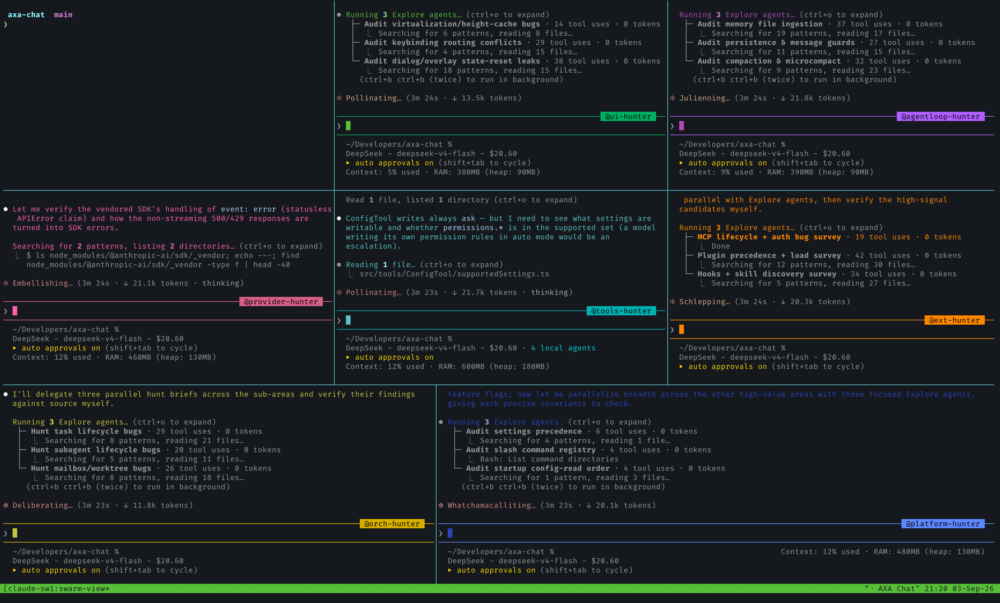

<p align="center">
  
</p>

<h1 align="center">axa-chat</h1>

<p align="center">
  <strong>Multi-provider AI coding CLI.</strong><br>
  All telemetry stripped. All guardrails removed. All experimental features unlocked.<br>
  One binary, zero callbacks home.
</p>

<p align="center">
  <a href="#quick-install"></a>
  <a href="https://github.com/cristianizzo/axa-chat/stargazers"></a>
  <a href="https://github.com/cristianizzo/axa-chat/issues"></a>
  <a href="https://github.com/cristianizzo/axa-chat/blob/main/FEATURES.md"></a>
</p>

---

## Quick Install

**macOS, Apple Silicon.** A prebuilt binary is downloaded — nothing is compiled on your machine, and Bun is not needed.

```bash
curl -fsSL https://raw.githubusercontent.com/cristianizzo/axa-chat/main/install.sh | bash
```

Then run `axa` and use the `/login` command to authenticate with your preferred model provider.

> **If you already have an `axa` shell function or alias**, it wins over anything on your PATH and the newly installed binary will not be what runs. The installer checks for this and says so instead of reporting success; follow what it prints.

<details>
<summary>Downloading the binary by hand instead</summary>

Grab `axa-<version>-darwin-arm64.tar.gz` and its `.sha256` from the [latest release](https://github.com/cristianizzo/axa-chat/releases), then:

```bash
shasum -a 256 -c axa-<version>-darwin-arm64.tar.gz.sha256
tar -xzf axa-<version>-darwin-arm64.tar.gz
xattr -d com.apple.quarantine axa && chmod +x axa
```

The `xattr` line is not optional. A browser marks its downloads with `com.apple.quarantine`, and a bare executable (as opposed to a `.app` or a `.pkg`) that carries that flag is **hard-blocked** by Gatekeeper — there is no right-click → Open escape hatch for this file shape. Clearing the flag yourself is the only way through, and it means you are vouching for the download, which is what the checksum above is for.

`curl` sets no quarantine flag, which is why the one-liner needs none of this.

</details>

### Updating

```
/update
```

from inside a session. It downloads the next version, verifies it, and repoints the symlink. Your running session keeps the binary it started with — a replaced file does not disturb a process that already has it open — so the new version is what launches next time.

### Rolling back

```bash
curl -fsSL https://raw.githubusercontent.com/cristianizzo/axa-chat/main/install.sh | bash -s -- --rollback
```

or, if you would rather not pipe a script while something is broken, one line you can type from memory:

```bash
ln -sfn ~/.local/share/axa/versions/<version> ~/.local/bin/axa
```

`ls ~/.local/share/axa/versions` shows what is still on disk. The last three versions are kept.

### Where things go

```
~/.local/bin/axa                      symlink -> the active version
~/.local/share/axa/versions/<v>       the binaries themselves
~/.local/share/axa/previous           what --rollback goes back to
```

Set `AXA_BIN_DIR` and `AXA_DATA_DIR` to move either of those.

Building it yourself is still supported and unaffected — see [Building from Source](#building-from-source).

---

## Table of Contents

- [What is this](#what-is-this)
- [Model Providers](#model-providers)
- [Quick Install](#quick-install)
- [Requirements](#requirements)
- [Building from Source](#building-from-source)
- [Usage](#usage)
- [Experimental Features](#experimental-features)
- [Project Structure](#project-structure)
- [Tech Stack](#tech-stack)
- [Contributing](#contributing)
- [License](#license)

---

## What is this

A multi-provider AI coding CLI built on top of Anthropic's [Claude Code](https://docs.anthropic.com/en/docs/claude-code) source. Supports Anthropic, OpenAI Codex, AWS Bedrock, Google Vertex AI, and Anthropic Foundry.

This fork applies three categories of changes on top of that snapshot:

### Telemetry removed

The upstream binary phones home through OpenTelemetry/gRPC, GrowthBook analytics, Sentry error reporting, and custom event logging. In this build:

- All outbound telemetry endpoints are dead-code-eliminated or stubbed
- GrowthBook feature flag evaluation still works locally (needed for runtime feature gates) but does not report back
- No crash reports, no usage analytics, no session fingerprinting

### Security-prompt guardrails removed

Anthropic injects system-level instructions into every conversation that constrain Claude's behavior beyond what the model itself enforces. These include hardcoded refusal patterns, injected "cyber risk" instruction blocks, and managed-settings security overlays pushed from Anthropic's servers.

This build strips those injections. The model's own safety training still applies -- this just removes the extra layer of prompt-level restrictions that the CLI wraps around it.

### Experimental features unlocked

Claude Code ships with 88 feature flags gated behind `bun:bundle` compile-time switches. Most are disabled in the public npm release. This build unlocks all 54 flags that compile cleanly. See [Experimental Features](#experimental-features) below, or refer to [FEATURES.md](FEATURES.md) for the full audit.

---

## Model Providers

axa-chat supports **five API providers** out of the box. Set the corresponding environment variable to switch providers -- no code changes needed.

### Anthropic (Direct API) -- Default

Use Anthropic's first-party API directly.

| Model | ID |
|---|---|
| Claude Fable 5 | `claude-fable-5` |
| Claude Mythos 5 (invite-only) | `claude-mythos-5` |
| Claude Opus 4.8 | `claude-opus-4-8` |
| Claude Sonnet 5 | `claude-sonnet-5` |
| Claude Opus 4.7 | `claude-opus-4-7` |
| Claude Opus 4.6 | `claude-opus-4-6` |
| Claude Sonnet 4.6 | `claude-sonnet-4-6` |
| Claude Haiku 4.5 | `claude-haiku-4-5` |

### OpenAI Codex

Use OpenAI's Codex models. Requires a ChatGPT Plus or Pro subscription.

Run `/login` and pick **OpenAI Codex account** — no environment variable needed.
The provider follows the account you signed in with, and the default model
becomes GPT-5.6-Terra.

| Model | ID |
|---|---|
| GPT-5.6-Sol | `gpt-5.6-sol` |
| GPT-5.6-Terra (default) | `gpt-5.6-terra` |
| GPT-5.6-Luna | `gpt-5.6-luna` |
| GPT-5.5 | `gpt-5.5` |
| GPT-5.2 | `gpt-5.2` |

These are the models the ChatGPT-subscription backend serves, which is a smaller
set than the metered platform API. Any other `gpt-*` ID you type is passed
through to the backend as-is.

### AWS Bedrock

Route requests through your AWS account via Amazon Bedrock.

```bash
export CLAUDE_CODE_USE_BEDROCK=1
export AWS_REGION="us-east-1"   # or AWS_DEFAULT_REGION
axa
```

Uses your standard AWS credentials (environment variables, `~/.aws/config`, or IAM role). Models are mapped to Bedrock ARN format automatically (e.g., `us.anthropic.claude-opus-4-6-v1`).

| Variable | Purpose |
|---|---|
| `CLAUDE_CODE_USE_BEDROCK` | Enable Bedrock provider |
| `AWS_REGION` / `AWS_DEFAULT_REGION` | AWS region (default: `us-east-1`) |
| `ANTHROPIC_BEDROCK_BASE_URL` | Custom Bedrock endpoint |
| `AWS_BEARER_TOKEN_BEDROCK` | Bearer token auth |
| `CLAUDE_CODE_SKIP_BEDROCK_AUTH` | Skip auth (testing) |

### Google Cloud Vertex AI

Route requests through your GCP project via Vertex AI.

```bash
export CLAUDE_CODE_USE_VERTEX=1
axa
```

Uses Google Cloud Application Default Credentials (`gcloud auth application-default login`). Models are mapped to Vertex format automatically (e.g., `claude-opus-4-6@latest`).

### Anthropic Foundry

Use Anthropic Foundry for dedicated deployments.

```bash
export CLAUDE_CODE_USE_FOUNDRY=1
export ANTHROPIC_FOUNDRY_API_KEY="..."
axa
```

Supports custom deployment IDs as model names.

### Provider Selection Summary

The cloud providers are deployment configuration, so they stay env-driven.
Anthropic and OpenAI Codex are chosen by logging in, and `/switch-account` moves
between accounts you have already authenticated.

| Provider | Selected by | Auth Method |
|---|---|---|
| Anthropic (default) | `/login` → Anthropic | `ANTHROPIC_API_KEY` or OAuth |
| OpenAI Codex | `/login` → OpenAI Codex | OAuth via OpenAI |
| AWS Bedrock | `CLAUDE_CODE_USE_BEDROCK=1` | AWS credentials |
| Google Vertex AI | `CLAUDE_CODE_USE_VERTEX=1` | `gcloud` ADC |
| Anthropic Foundry | `CLAUDE_CODE_USE_FOUNDRY=1` | `ANTHROPIC_FOUNDRY_API_KEY` |

---

## Requirements

To **install and run** the released binary:

- **OS**: macOS on Apple Silicon (arm64). This is the only published artifact; see below.
- **Tools**: `curl`, `tar`, `shasum` — all present on a stock macOS.
- **Auth**: An API key or OAuth login for your chosen provider.

No Bun, no toolchain, no compiler: the binary is self-contained.

To **build from source** you additionally need [Bun](https://bun.sh) >= 1.4.0:

```bash
curl -fsSL https://bun.sh/install | bash
```

### Why only macOS arm64

The build passes `--target bun` to `bun build --compile`, which produces a binary for the machine it runs on. Every additional platform is therefore another release runner producing an artifact nobody here can run on real hardware before publishing it. Publishing an untested `darwin-x64` or Linux build would be worse than publishing none, so `install.sh` refuses on those platforms and points here rather than failing obscurely.

Building from source works anywhere Bun does, including Linux and Intel Macs. What is unsupported is the *released* binary, not the project.

---

## Building from Source

```bash
git clone https://github.com/cristianizzo/axa-chat.git
cd axa-chat
bun install
bun run build:dev
./cli-dev
```

### Build Variants

| Command | Output | Features | Description |
|---|---|---|---|
| `bun run build` | `./cli` | `VOICE_MODE` only | Production-like binary |
| `bun run build:dev` | `./cli-dev` | `VOICE_MODE` only | Dev version stamp |
| `bun run build:dev:full` | `./cli-dev` | All 54 experimental flags | Full unlock build |
| `bun run compile` | `./dist/cli` | `VOICE_MODE` only | Alternative output path |

### Update & Rebuild

`/update` does one of two things, decided by where the running executable
actually sits rather than by a flag:

- **A released install** — a versioned file under `~/.local/share/axa/versions`
  with `~/.local/bin/axa` pointing at it — downloads the next version, verifies
  its checksum, and moves the symlink. See [Rolling back](#rolling-back) if it
  goes wrong.
- **A source checkout** — the binary sitting at the source root beside
  `package.json` — pulls and rebuilds, which is what `bun run update` does by
  hand:

```bash
bun run update
```

A checkout can also update itself once a day from an idle session, staging the
build into `cli-dev.next` and swapping it in with an atomic rename. The running
session is unaffected either way; the new build starts with the next `axa`. Turn
it off with `autoUpdate` in `/config`.

Opting in is a `.axa-install.json` file at the source root. A checkout you cloned
yourself does not have one and is left alone — which is now the normal case,
since the installer no longer builds from source and so no longer writes a
marker. Older installs that were built by `install.sh` keep theirs and keep
updating.

The self-update is skipped whenever a `git pull` would not be plainly safe: any
uncommitted change, any untracked file that is not gitignored, unpushed commits,
a detached HEAD, or a branch with no upstream. The untracked case is easy to hit
and silent — one scratch file at the source root keeps the tree on the build it
has. Run `bun run update` yourself when that happens.

### Custom Feature Flags

Enable specific flags without the full bundle:

```bash
# Enable just ultraplan and ultrathink
bun run ./scripts/build.ts --feature=ULTRAPLAN --feature=ULTRATHINK

# Add a flag on top of the dev build
bun run ./scripts/build.ts --dev --feature=BRIDGE_MODE
```

---

## Usage

```bash
# Interactive REPL (default)
axa

# One-shot mode
axa -p "what files are in this directory?"

# Specify a model
axa --model claude-opus-4-6

# Run from source (slower startup)
bun run dev

# OAuth login
axa /login
```

### Environment Variables Reference

| Variable | Purpose |
|---|---|
| `ANTHROPIC_API_KEY` | Anthropic API key |
| `ANTHROPIC_AUTH_TOKEN` | Auth token (alternative) |
| `ANTHROPIC_MODEL` | Override default model |
| `ANTHROPIC_BASE_URL` | Custom API endpoint |
| `ANTHROPIC_DEFAULT_OPUS_MODEL` | Custom Opus model ID |
| `ANTHROPIC_DEFAULT_SONNET_MODEL` | Custom Sonnet model ID |
| `ANTHROPIC_DEFAULT_HAIKU_MODEL` | Custom Haiku model ID |
| `CLAUDE_CODE_OAUTH_TOKEN` | OAuth token via env |
| `CLAUDE_CODE_API_KEY_HELPER_TTL_MS` | API key helper cache TTL |

---

## Experimental Features

The `bun run build:dev:full` build enables all 54 working feature flags. Highlights:

### Interaction & UI

| Flag | Description |
|---|---|
| `ULTRAPLAN` | Remote multi-agent planning on Claude Code web (Opus-class) |
| `ULTRATHINK` | Deep thinking mode -- type "ultrathink" to boost reasoning effort |
| `VOICE_MODE` | Push-to-talk voice input and dictation |
| `TOKEN_BUDGET` | Token budget tracking and usage warnings |
| `HISTORY_PICKER` | Interactive prompt history picker |
| `MESSAGE_ACTIONS` | Message action entrypoints in the UI |
| `QUICK_SEARCH` | Prompt quick-search |
| `SHOT_STATS` | Shot-distribution stats |

### Agents, Memory & Planning

| Flag | Description |
|---|---|
| `BUILTIN_EXPLORE_PLAN_AGENTS` | Built-in explore/plan agent presets |
| `VERIFICATION_AGENT` | Verification agent for task validation |
| `AGENT_TRIGGERS` | Local cron/trigger tools for background automation |
| `AGENT_TRIGGERS_REMOTE` | Remote trigger tool path |
| `EXTRACT_MEMORIES` | Post-query automatic memory extraction |
| `COMPACTION_REMINDERS` | Smart reminders around context compaction |
| `CACHED_MICROCOMPACT` | Cached microcompact state through query flows |
| `TEAMMEM` | Team-memory files and watcher hooks |

### Tools & Infrastructure

| Flag | Description |
|---|---|
| `BRIDGE_MODE` | IDE remote-control bridge (VS Code, JetBrains) |
| `BASH_CLASSIFIER` | Classifier-assisted bash permission decisions |
| `PROMPT_CACHE_BREAK_DETECTION` | Cache-break detection in compaction/query flow |

See [FEATURES.md](FEATURES.md) for the complete audit of all 88 flags, including 34 broken flags with reconstruction notes.

---

## Project Structure

```
scripts/
  build.ts                # Build script with feature flag system

src/
  entrypoints/cli.tsx     # CLI entrypoint
  commands.ts             # Command registry (slash commands)
  tools.ts                # Tool registry (agent tools)
  QueryEngine.ts          # LLM query engine
  screens/REPL.tsx        # Main interactive UI (Ink/React)

  commands/               # /slash command implementations
  tools/                  # Agent tool implementations (Bash, Read, Edit, etc.)
  components/             # Ink/React terminal UI components
  hooks/                  # React hooks
  services/               # API clients, MCP, OAuth, analytics
    api/                  # API client + Codex fetch adapter
    oauth/                # OAuth flows (Anthropic + OpenAI)
  state/                  # App state store
  utils/                  # Utilities
    model/                # Model configs, providers, validation
  skills/                 # Skill system
  plugins/                # Plugin system
  bridge/                 # IDE bridge
  voice/                  # Voice input
  tasks/                  # Background task management
```

---

## Tech Stack

| | |
|---|---|
| **Runtime** | [Bun](https://bun.sh) |
| **Language** | TypeScript |
| **Terminal UI** | React + [Ink](https://github.com/vadimdemedes/ink) |
| **CLI Parsing** | [Commander.js](https://github.com/tj/commander.js) |
| **Schema Validation** | Zod v4 |
| **Code Search** | ripgrep (bundled) |
| **Protocols** | MCP, LSP |
| **APIs** | Anthropic Messages, OpenAI Codex, AWS Bedrock, Google Vertex AI |

---

## Contributing

1. Fork the repository
2. Create a feature branch (`git checkout -b feat/my-feature`)
3. Commit your changes (`git commit -m 'feat: add something'`)
4. Push to the branch (`git push origin feat/my-feature`)
5. Open a Pull Request

---

## License

The original Claude Code source is the property of Anthropic. This fork exists because the source was publicly exposed through their npm distribution. Use at your own discretion.
