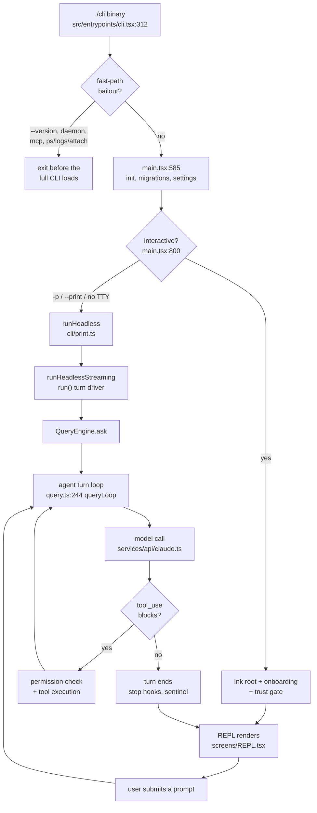
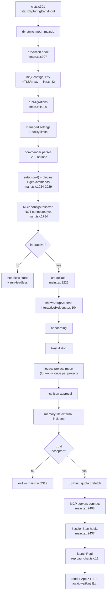
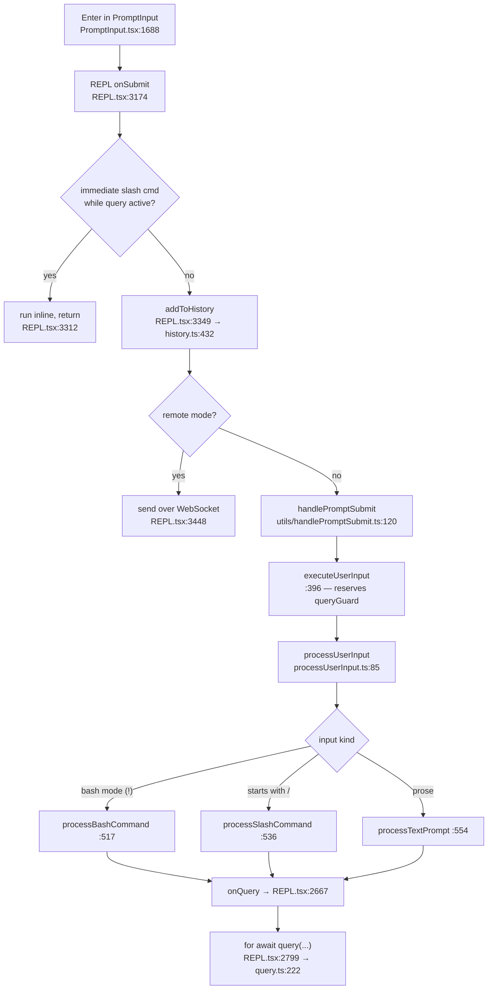
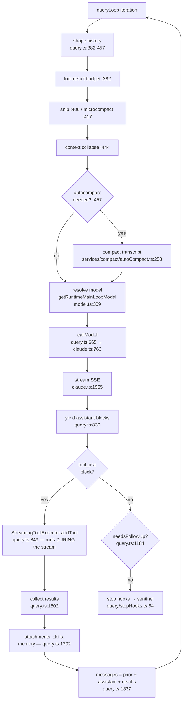
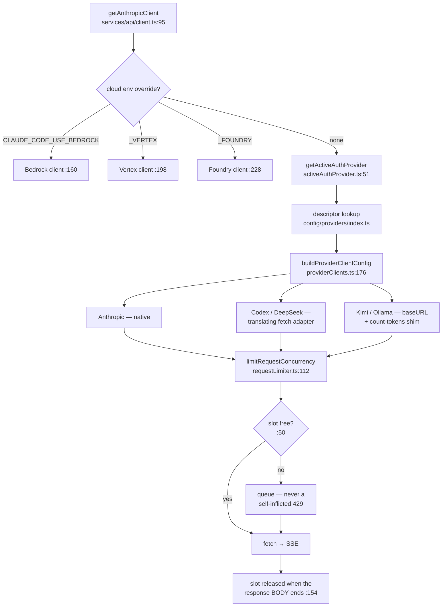
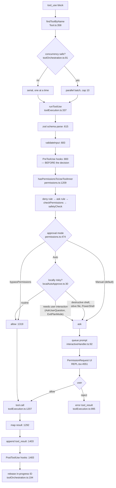
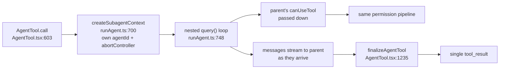

# AXA Chat — application flow

**Created:** 2026-08-27. Traced against the source, not inferred from docs;
every `file:line` below was read. Line numbers drift — treat them as
"look here", not as addresses.

Six diagrams, zooming in: whole lifecycle → startup → prompt submit → the agent
turn loop → provider/network resolution → tool execution and permissions.

---

## 1. Whole lifecycle

Two things worth noting up front:

- **`src/QueryEngine.ts` is not on the interactive path, but it is not
  unimported.** `src/cli/print.ts` imports `ask` from it and is its *only*
  importer — every other mention of `QueryEngine` in the tree is a comment. So
  the headless edge above runs `runHeadless` → `QueryEngine.ask` → `query()` →
  `queryLoop`, not straight into the loop. QueryEngine serves the SDK,
  `-p`/print and the spawn bridge — and since `cli/print.ts` is its only
  importer, all three necessarily reach it through that file. The REPL calls
  `query()` in `src/query.ts` directly.
- **Headless and interactive converge** on the same loop. The difference is
  everything *around* it: no Ink, no *rendered* permission prompt, filtered
  command list — and the filter is `commandsHeadless` in `main.tsx`, not
  anything in `print.ts`. Headless still asks: `getCanUseToolFn` in
  `cli/print.ts` has three arms — `stdio` round-trips the prompt to the SDK host
  as a `can_use_tool` control request, a named `--permission-prompt-tool` races
  an MCP tool against the abort signal, and only the unset case falls through to
  bare `hasPermissionsToUseTool`. `--sdk-url` forces `stdio`.

---

## 2. Startup

**Why MCP connects late — and the one path where it does not.** In an
*interactive* session, configs are resolved well before `showSetupScreens`, but
the servers are only dialled by `connectMcpBatch` further down `main.tsx`, after
`showSetupScreens` has returned. Connecting first would run third-party server
code in a directory the user has not yet trusted.

**Headless (`-p`) does not take that gate at all.** `showSetupScreens` is on the
interactive branch only — `interactiveHelpers.tsx` says so in as many words
("non-interactive sessions (CI/CD with -p) never reach showSetupScreens at
all"), and the `isNonInteractiveSession` branch in `main.tsx` calls
`applyConfigEnvironmentVariables()` and `initializeTelemetryAfterTrust()`
directly, above the same `connectMcpBatch` the interactive path uses. So under
`-p` the project's MCP servers are dialled with no trust prompt. That is
deliberate and stated in three separate in-tree comments — print mode is
*defined* as trusted, "as documented in help text" — not an oversight. Treat
"MCP connects after the trust dialog" as an **interactive-only** invariant; a
change that relies on it holding everywhere is wrong.

The same asymmetry applies to trust-gated startup generally: `-p` re-does
settings work inside `print.ts` (`downloadUserSettings`,
`settingsChangeDetector.subscribe`, `waitForRemoteManagedSettingsToLoad`), so
"settings are finished by startup" is an interactive-only statement too.

**Seven REPL launch branches** (`main.tsx:3134`–`3798`): `--continue`, direct
connect (`cc://`), `ssh`, `assistant`, `--remote-control`, resume/teleport, and
the default. All funnel into the same `launchRepl`.

**The sentinel is not a startup step.** `initSentinel`
(`services/sentinel/sentinel.ts:62`) is reached via `startBackgroundHousekeeping`,
which an interactive session calls lazily on the *first* submit
(`REPL.tsx:3937`, guarded by `submitCount === 1`). The scan itself runs from
`query/stopHooks.ts:54`, at turn end.

---

## 3. Prompt submit → query layer

`REPL.tsx` (~5000 lines) owns both halves of the screen: the message list
(`<Messages>` at `:4602`) and the input (`<PromptInput>` at `:4935`).
`components/App.tsx` is a 55-line provider wrapper holding no state.

**History has two writers:** the normal submit path (`REPL.tsx:3349`) and the
double-Esc clear (`hooks/useTextInput.ts:146`).

---

## 4. The agent turn loop

`query.ts:244 queryLoop` — a `while (true)` async generator. One iteration is
one model call plus the tools it asked for.

**Context assembled once per turn**, not per iteration — `REPL.tsx:2774-2793`
runs one `Promise.all` over `getSystemPrompt(...)`, `getUserContext()`
(CLAUDE.md + date, `context.ts:155`) and `getSystemContext()` (git status,
`context.ts:116`), merged by `utils/systemPrompt.ts`.

**Tools are executed while the response is still streaming.** Each `tool_use`
block is dispatched the moment it completes rather than after the message does
(`query.ts:849`). The non-streaming `runTools` path still exists as a fallback
(`query.ts:1502`), gated by `config.gates.streamingToolExecution`.

**Error/fallback branches** (`services/api/withRetry.ts:195`), all caught back
in `query.ts:901`/`:973`, which tombstone the partial attempt and re-enter the
loop:

| Condition | Behaviour |
|---|---|
| 429 | delay from `retry-after`, floored at the backoff minimum |
| 3 consecutive 529s | `FallbackTriggeredError` → Opus→Sonnet if a fallback exists |
| AUP refusal | `RefusalFallbackError` |
| 413 / media too large | reactive compaction, `query.ts:1207` |

---

## 5. Provider and network resolution

This is the fork's distinguishing layer: five accounts are logged in *at once*
and `/switch-account` swaps which one serves the conversation, mid-thread,
without touching message history.

Three details that are load-bearing and non-obvious:

1. **The cloud overrides bypass the account entirely.** They return a client
   *before* the per-account branch at `client.ts:311`; only the model name
   survives. Hence `isActiveAccountServingRequests()`
   (`model/providers.ts:45`), which the banner and the small-fast-model tier
   both consult.
2. **The concurrency slot is held until the response body finishes**, not until
   `fetch` resolves. `claude.ts:1861` returns the stream and it is consumed
   outside `withRetry`, so releasing on resolution would let a whole subagent
   fan-out through at once. Kimi is capped at 1 (entry-tier limit); override
   with `CLAUDE_CODE_MAX_CONCURRENT_REQUESTS`.
3. **Codex and DeepSeek speak OpenAI SSE**, re-emitted as Anthropic SSE inside
   the fetch adapter (`codex-fetch-adapter.ts:425`), so everything above the
   client is provider-agnostic.

### Small fast model

`getSmallFastModel()` (`model/model.ts:60`), resolved in order: the
`ANTHROPIC_SMALL_FAST_MODEL` env var → Haiku if a cloud override is active →
Ollama's single recorded model → otherwise the active descriptor's
`catalog.smallFastModel` (DeepSeek `haiku → deepseek-v4-flash`, Codex
`haiku → gpt-5.6-luna`).

It serves ~8 background jobs: tool-use summaries, API-key verification, token
estimation, session titles, away summaries, session search, prompt/agent hooks,
and WebSearch summarisation. Compaction and commit messages do **not** use it —
they run on the main model.

---

## 6. Tool execution and permissions

**The seven checks at `permissions.ts:1209` are ordered and the first six are
bypass-immune** — even `bypassPermissions` cannot get past a deny rule or
`safetyCheck`. "Skip all" means "skip the *asking*", not "skip the *rules*".

**Auto mode is network-free.** `isLocallyRiskyAction` keys off `safetyCheck`,
a PowerShell test, and `getDestructiveCommandWarning`
(`BashTool/destructiveCommandWarning.ts:95`) — no classifier call, so it costs
nothing and works offline. In headless mode, risky + auto = **deny**, not
prompt (`permissions.ts:545`).

**Cancellation.** Esc → `useCancelRequest.ts:97` → `abortController.abort('user-cancel')`
(or the dialog's `onAbort` if a permission prompt has focus). The executor maps
the reason via `getAbortReason` and synthesises a REJECT tool_result, so the
transcript never has a dangling `tool_use` without a `tool_result`. Retry and
fallback use `discard()` (`StreamingToolExecutor.ts:92`), which kills in-flight
tools through a sibling abort controller and clears their in-progress IDs.

### Subagents

A subagent is a *full* nested `query()` loop with its own abort controller, but
it is handed the **parent's** `canUseTool` — so a subagent's tools face exactly
the same permission checks, and prompts surface in the parent's UI.
`isConcurrencySafe` is `true`, so parallel `Agent` calls really do run at once.

---

## Where the fork diverges from upstream

| Area | What this fork changed |
|---|---|
| Auth | Five concurrent accounts + `/switch-account`; `config/providers/*` descriptors, exhaustively typed |
| Networking | Per-provider in-flight cap held to end-of-body (`requestLimiter.ts`) |
| Permissions | Three-tier modes; Auto uses local, network-free risk detection |
| Banner | Connected-account status lights (`logoV2Utils.ts`, `LogoV2/ProviderStatusLights.tsx`) |
| Background | Repo sentinel at turn end (`services/sentinel/`) |
