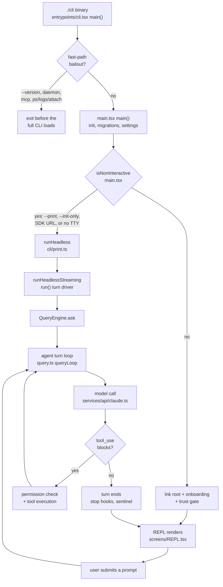
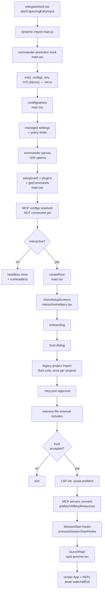
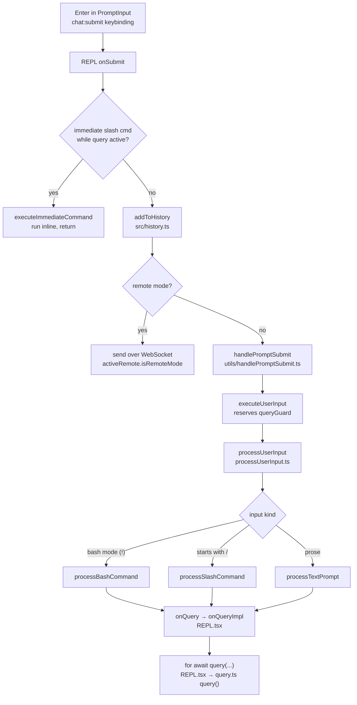
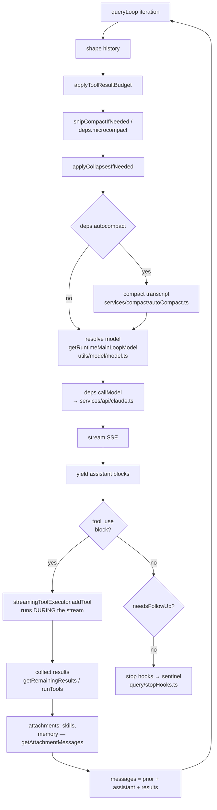
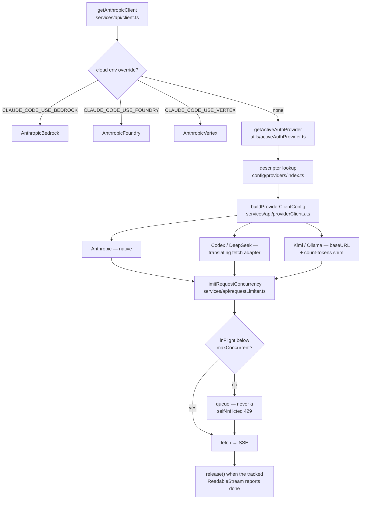
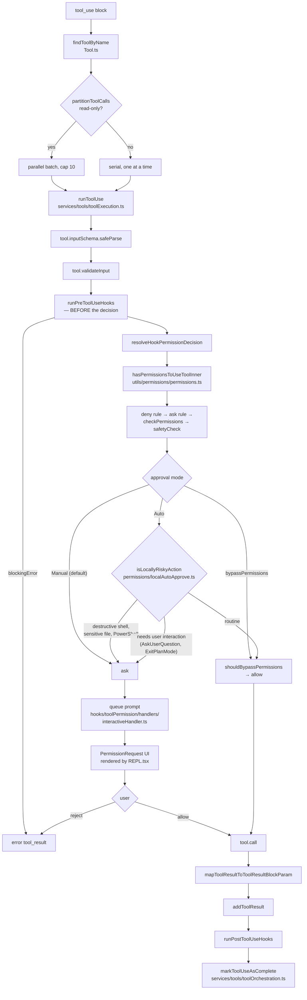
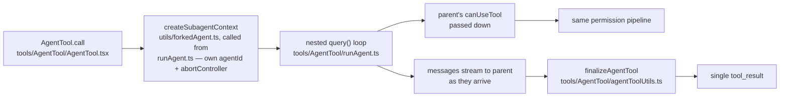
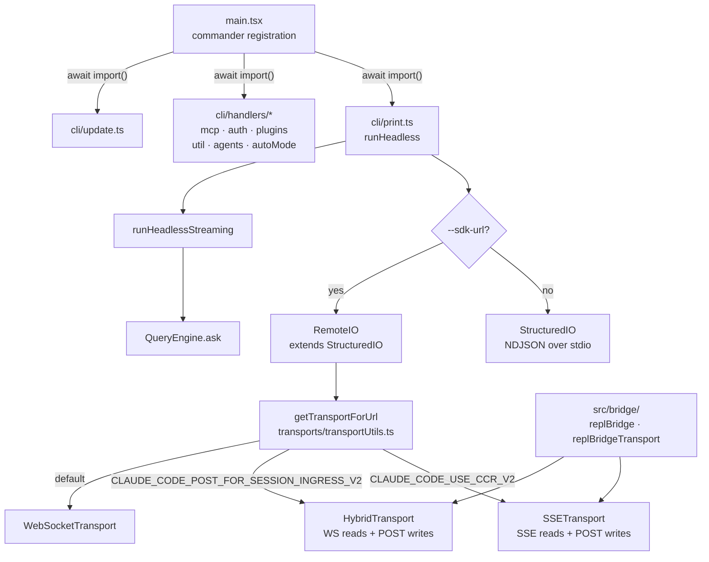

# AXA Chat — application flow

**Created:** 2026-08-27. **De-numbered 2026-09-04.** Traced against the source,
not inferred from docs — every claim below was read out of the file it names.

This document deliberately carries **no line numbers**. It cites files and
*symbol names* instead, because a line number is a fact with an expiry date: the
first merge that shifts twenty lines invalidates it silently, with no test and no
error, while the document still reads as authoritative. Grep the symbol. If you
add to this file, keep it that way — and prefer a `queryCheckpoint` label or an
exported function name over a landmark that only exists in prose.

**Every path here is a *suffix* of a real path**, not a path from the repo root
— `main.tsx` is `src/main.tsx`, `BashTool/pathValidation.ts` is
`src/tools/BashTool/pathValidation.ts`. Resolve one with
`git ls-files '*<suffix>'`. Written this way because the shortest unambiguous
suffix survives a directory move, which a rooted path does not, and this
document is built to survive drift.

Measured over the 90 distinct file names cited below: **78 resolve as suffixes
against `origin/main`, and 12 do not.** All 12 are enumerated here, because a
count with a partial list is the shape that gets silently completed wrong — an
earlier revision of this paragraph named 7 and asserted 12, and its one-line
reason was false for 3 of the 5 it left unnamed. They fall into three groups,
for three different reasons:

1. **Six that genuinely have no file, and are cited precisely because they do
   not** — the dangling `handlers/ant.js`, `up.js`, `rollback.js` and
   `templateJobs.js` imports and the phantom `Transport.js` contract (§7), and
   `REPLTool/toolWrappers.ts` behind the `USER_TYPE === 'ant'` gate (§6).
2. **Two that are second spellings of things already in group 1**, counted
   separately only because the sweep counts distinct strings —
   `cli/transports/Transport.ts` (the `.ts` spelling of the same phantom) and
   `cli/up.js` (the path-qualified spelling of the same dangling handler). No
   new missing files here.
3. **Three that are ESM import specifiers, not filenames** — `cli/print.js`,
   `cli/update.js` and `main.js`. These resolve to `src/cli/print.ts`,
   `src/cli/update.ts` and `src/main.tsx`, which all exist. A `.js` specifier
   for a TypeScript source is the normal ESM spelling (§7 covers the ~30
   dynamic imports that use it), so **these are not defects and must not be
   "corrected" to `.ts`** — the import statements in the source say `.js`, and
   the document quotes them as written.

Plus `.mcp.json`, a per-project file the user creates, which is the twelfth.
So a citation that fails to resolve is a bug in this document, with those
exceptions and no others.

**Resolve with a suffix match, not a substring match.** Checking the list above
with `grep -F` instead of an anchored `(^|/)<name>$` reports 78 resolving rather
than 77 — one name substring-matches an unrelated path and the loose instrument
reads it as found. That is a one-line discrepancy that looks like drift in the
document and is actually drift in the check.

One deliberate omission, kept as a warning rather than fixed silently: an
earlier revision called the phantom transport "untracked". That contradicted
§7's *"does not exist and never has"*, and both statements were true of
different things — a stray untracked copy sat in *one developer's* working
tree, while `git log --all` on that path is empty for the repository. **A
statement about a working tree does not belong in a document about the
repository.** `git ls-files` reads an index, `git ls-tree <ref>` reads a ref,
and `ls` reads a disk; only the middle one generalises past the machine it was
run on.

**Environment variables are the one thing spelled in full, never abbreviated** —
paths get shortened because a *suffix* still resolves, but a truncated env name
resolves to nothing and there is no rule for reconstructing the missing prefix.
The counter-example is in this document's own history: `CCR_V2` and
`POST_FOR_SESSION_INGRESS_V2` (§7) look like they share a prefix, and they do
not — the real names are `CLAUDE_CODE_USE_CCR_V2` and
`CLAUDE_CODE_POST_FOR_SESSION_INGRESS_V2`, so guessing `CLAUDE_CODE_USE_` from
the first gives a name that exists nowhere for the second. Measured over every
`[A-Z][A-Z0-9_]{3,}` token cited below: all resolve in `src/` on `main` except
`TS2307`, a `tsc` diagnostic code and not an identifier.

Seven numbered sections, zooming in: whole lifecycle → startup → prompt submit →
the agent turn loop → provider/network resolution → tool execution and
permissions → the non-interactive `src/cli/` surface. §6 carries a second
diagram, for subagents.

---

## 1. Whole lifecycle

Two things worth noting up front:

- **`src/QueryEngine.ts` is not on the interactive path, but it is not
  unimported.** `src/cli/print.ts` imports `ask` from it and is its *only*
  importer — every other mention of `QueryEngine` in the tree is a comment. So
  the headless edge above runs `runHeadless` → `QueryEngine.ask` → `query()` →
  `queryLoop`, not straight into the loop. QueryEngine serves the SDK,
  `-p`/print and the spawn bridge — and since `cli/print.ts` is its only
  importer, all three necessarily reach it through that file. The REPL calls
  `query()` in `src/query.ts` directly.
- **Headless and interactive converge** on the same loop. The difference is
  everything *around* it: no Ink, no *rendered* permission prompt, filtered
  command list — and the filter is `commandsHeadless` in `main.tsx`, not
  anything in `print.ts`. Headless still asks: `getCanUseToolFn` in
  `cli/print.ts` has three arms — `stdio` round-trips the prompt to the SDK host
  as a `can_use_tool` control request, a named `--permission-prompt-tool` races
  an MCP tool against the abort signal, and only the unset case falls through to
  bare `hasPermissionsToUseTool`. `--sdk-url` forces `stdio`.

---

## 2. Startup

**Why MCP connects late — and the one path where it does not.** In an
*interactive* session, configs are resolved well before `showSetupScreens`, but
the servers are only dialled by `prefetchAllMcpResources`, further down
`main.tsx` and after `showSetupScreens` has returned — the config-resolution site
says so in as many words (*"we do NOT call prefetchAllMcpResources here — that's
deferred until after trust dialog"*). Connecting first would run third-party
server code in a directory the user has not yet trusted.

**Headless (`-p`) does not take that gate at all.** `showSetupScreens` is on the
interactive branch only — `interactiveHelpers.tsx` says so in as many words
("non-interactive sessions (CI/CD with -p) never reach showSetupScreens at
all"), and the `isNonInteractiveSession` branch in `main.tsx` calls
`applyConfigEnvironmentVariables()` and `initializeTelemetryAfterTrust()`
directly. The two branches do not even share a dialling function: interactive
uses `prefetchAllMcpResources`, while `-p` has its own `connectMcpBatch` declared
*inside* the `isNonInteractiveSession` block, which pushes each server into the
headless store incrementally. So under
`-p` the project's MCP servers are dialled with no trust prompt. That is
deliberate and stated in three separate in-tree comments — print mode is
*defined* as trusted, "as documented in help text" — not an oversight. Treat
"MCP connects after the trust dialog" as an **interactive-only** invariant; a
change that relies on it holding everywhere is wrong.

The same asymmetry applies to trust-gated startup generally: `-p` re-does
settings work inside `print.ts` (`downloadUserSettings`,
`settingsChangeDetector.subscribe`, `waitForRemoteManagedSettingsToLoad`), so
"settings are finished by startup" is an interactive-only statement too.

**Seven REPL launch branches** — seven `await launchRepl(` call sites in
`main.tsx`: `--continue`, direct
connect (`cc://`), `ssh`, `assistant`, `--remote-control`, resume/teleport, and
the default. All funnel into the same `launchRepl`.

**The sentinel is not a startup step — in an interactive session.** `initSentinel`
(`services/sentinel/sentinel.ts`) is reached only via `startBackgroundHousekeeping`
in `utils/backgroundHousekeeping.ts`, which an interactive session calls lazily on
the *first* submit (`REPL.tsx`, guarded by `submitCount === 1`). Under `-p` the
headless branch calls the same function eagerly, right after its MCP connects, so
"lazy on first submit" is another interactive-only statement. Either way the scan
itself runs from `executeSentinel` in `query/stopHooks.ts`, at turn end.

---

## 3. Prompt submit → query layer

`REPL.tsx` (~5000 lines) owns both halves of the screen: it renders both
`<Messages>` and `<PromptInput>`. `components/App.tsx` is a 55-line provider
wrapper holding no state.

**History has three writers**, and `addToHistory` is exported from `src/history.ts`
— grep its call sites rather than trusting this list: the normal submit path in
`REPL.tsx`, the double-Esc clear in `hooks/useTextInput.ts` (which saves the
buffer before wiping it), and `main.tsx`, which seeds a CLI-supplied initial
prompt into history before the REPL renders.

---

## 4. The agent turn loop

`queryLoop` in `query.ts` — a `while (true)` async generator. One iteration is
one model call plus the tools it asked for.

The history-shaping stages are the easiest part of this file to locate: each is
preceded by a `queryCheckpoint('query_<stage>_start')` call, so grep the
checkpoint name rather than a line number.

**Context assembled once per turn**, not per iteration — `onQueryImpl` in
`REPL.tsx` runs one `Promise.all` between the `query_context_loading_start` and
`query_context_loading_end` checkpoints, covering the default system prompt,
`getUserContext()` (memory files + date) and `getSystemContext()` (git status), both
exported from `src/context.ts` and both `memoize`d there. The three are merged by
`buildEffectiveSystemPrompt` in `utils/systemPrompt.ts`.

**Tools are executed while the response is still streaming.** Each `tool_use`
block is dispatched the moment it completes rather than after the message does
(`streamingToolExecutor.addTool`, inside the stream loop). The non-streaming
`runTools` path still exists as a fallback on the other arm of the same
`streamingToolExecutor ? … : runTools(…)` expression, gated by
`config.gates.streamingToolExecution`.

**Error/fallback branches.** The error classes live in
`services/api/withRetry.ts`; all are caught back in `query.ts`'s single
`catch (innerError)`, whose `FallbackTriggeredError` and `RefusalFallbackError`
branches tombstone the partial attempt and re-enter the loop:

| Condition | Behaviour |
|---|---|
| 429 | delay from `retry-after`, floored at the backoff minimum |
| 3 consecutive 529s | `FallbackTriggeredError` → Opus→Sonnet if a fallback exists |
| AUP refusal | `RefusalFallbackError` |
| 413 / media too large | reactive compaction — the `isWithheld413` / `isWithheldMediaSizeError` branch in `query.ts` |

---

## 5. Provider and network resolution

This is the fork's distinguishing layer: five accounts are logged in *at once*
and `/switch-account` swaps which one serves the conversation, mid-thread,
without touching message history.

Three details that are load-bearing and non-obvious:

1. **The cloud overrides bypass the account entirely.** They return a client
   *before* the "Non-Anthropic account providers" branch further down
   `client.ts`; only the model name survives. Hence
   `isActiveAccountServingRequests()` in `utils/model/providers.ts`, which the
   banner and the small-fast-model tier both consult.
2. **The concurrency slot is held until the response body finishes**, not until
   `fetch` resolves. `services/api/claude.ts` returns the stream and it is consumed
   outside `withRetry`, so releasing on resolution would let a whole subagent
   fan-out through at once. The release is wired into the `ReadableStream` that
   wraps `response.body`, plus an early `release()` for the bodyless case. Kimi
   is capped at 1 (entry-tier limit); override with
   `CLAUDE_CODE_MAX_CONCURRENT_REQUESTS`.
3. **Codex and DeepSeek speak OpenAI SSE**, re-emitted as Anthropic SSE inside
   the fetch adapter (`codex-fetch-adapter.ts`), so everything above the
   client is provider-agnostic.

### Small fast model

`getSmallFastModel()` in `utils/model/model.ts`, resolved in order: the
`ANTHROPIC_SMALL_FAST_MODEL` env var → Haiku if a cloud override is active →
Ollama's single recorded model → otherwise the active descriptor's
`catalog.smallFastModel` (DeepSeek `haiku → deepseek-v4-flash`, Codex
`haiku → gpt-5.6-luna`).

It serves ~8 background jobs: tool-use summaries, API-key verification, token
estimation, session titles, away summaries, session search, prompt/agent hooks,
and WebSearch summarisation. Compaction and commit messages do **not** use it —
they run on the main model.

---

## 6. Tool execution and permissions

**`hasPermissionsToUseToolInner` runs seven ordered checks, `1a`–`1g`, and all
seven are bypass-immune** — every one of them `return`s before `2a`, which is the
only place the permission *mode* is consulted at all. So `bypassPermissions`
cannot get past a deny rule, a content-specific ask rule (`1f`), a
`requiresUserInteraction` tool (`1e`) or a `safetyCheck` (`1g`). "Skip all" means
"skip the *asking*", not "skip the *rules*". Grep the `// 1a.`–`// 2b.` step
comments; note that the sibling `checkRuleBasedPermissions` carries its own
`1a`–`1g` numbering with **no `1e`**, so the labels are per-function, not global.

One non-obvious branch at `2a`: bypass is granted when the mode is
`bypassPermissions` **or** when the mode is `plan` and
`isBypassPermissionsModeAvailable` is set — i.e. a session that *started* in
bypass keeps it through plan mode. Plan mode is not by itself a stricter mode
here.

**PreToolUse hooks run before the decision, and the arrow points both ways.**
A hook that reports a `blockingError` denies the call outright — the failure
path is a *deny*, not a skip. In the other direction, a hook that returns
`allow` does **not** buy a bypass: `resolveHookPermissionDecision` in
`services/tools/toolHooks.ts` re-runs `checkRuleBasedPermissions` over the
hook's `updatedInput`, so a settings deny rule still overrides the hook and an
ask rule still forces the dialog. `toolExecution.ts` is its only caller — its
docstring used to name a second one in `REPLTool/toolWrappers.ts`, a file that
does not ship in this fork because `REPLTool` is gated on `USER_TYPE === 'ant'`.
The reason it stays a separate exported function is the invariant, not the
caller count: a future caller must route the hook result through it rather than
act on `allow` directly, and a second implementation of that precedence would be
a defect.

**Auto mode is network-free.** `isLocallyRiskyAction` keys off `safetyCheck`,
a PowerShell test, and `getDestructiveCommandWarning`
(`BashTool/destructiveCommandWarning.ts`) — no classifier call, so it costs
nothing and works offline. When `shouldAvoidPermissionPrompts` is set — which is
how headless expresses "nobody is there to answer" — risky + auto resolves to
**deny**, not prompt.

**Cancellation.** Esc → `useCancelRequest.ts` → `abortController.abort('user-cancel')`
(or the dialog's `onAbort` if a permission prompt has focus). The executor maps
the reason via `getAbortReason` and synthesises a REJECT tool_result, so the
transcript never has a dangling `tool_use` without a `tool_result`. Retry and
fallback use `StreamingToolExecutor`'s `discard()`, which kills in-flight
tools through a sibling abort controller and clears their in-progress IDs.

### Sandbox

Real, live, and not ant-gated. It is a thin fork-side adapter —
`utils/sandbox/sandbox-adapter.ts`, exporting the `SandboxManager` singleton —
over the external `@anthropic-ai/sandbox-runtime` package. `entrypoints/sandboxTypes.ts`
holds the zod schema for the `sandbox` settings block.

**It is not a tool-level feature and it is not applied by the tool.** The
per-invocation decision is `shouldUseSandbox(input)` in
`tools/BashTool/shouldUseSandbox.ts`, but the *application* point is
`utils/Shell.ts`: when the caller passes `shouldUseSandbox`, Shell calls
`SandboxManager.wrapWithSandbox(...)` and rewrites the command string before
spawn. Exactly two tools route through it — **Bash** and **PowerShell** (forced
off on Windows). File tools are unaffected; they are constrained at app level by
`pathInAllowedWorkingPath()`.

**Enablement is settings-only** — no env var, no permission mode.
`sandbox.enabled` defaults to **false**; `autoAllowBashIfSandboxed` defaults to
**true**, so turning the sandbox on also turns the auto-allow on unless it is
explicitly disabled. Per-call `dangerouslyDisableSandbox` is honoured only when
`allowUnsandboxedCommands` is set.

**Platform support is delegated** to the package's `isSupportedPlatform()`:
macOS, Linux and WSL2+ (not WSL1, not native Windows). Linux additionally needs
`bubblewrap`/`socat`, and because bubblewrap cannot express globs,
`getLinuxGlobPatternWarnings()` exists to flag glob patterns in rules that will
silently under-restrict there.

> **The unsupported-platform path is a passthrough, by design but worth knowing.**
> `isSandboxingEnabled()` returns `false` on an unsupported platform, on missing
> dependencies, or when the platform is absent from `sandbox.enabledPlatforms` —
> so `shouldUseSandbox()` returns false and the command simply runs unsandboxed.
> It is no longer *silent*: `getSandboxUnavailableReason()` produces a message,
> and all three tool-executing entrypoints (`screens/REPL.tsx`, `cli/print.ts`,
> `entrypoints/mcp.ts`) print it and hard-exit 1 when `sandbox.failIfUnavailable`
> is set. If you want a fail-closed sandbox, that setting is the only thing that
> gives you one.

**What it restricts.** Both filesystem and network, via
`convertToSandboxRuntimeConfig(settings)`. Writable by default: cwd and
`getClaudeTempDir()`, plus `permissions.additionalDirectories`, the session-only
`getAdditionalDirectoriesForClaudeMd()` set, and the main repo path when cwd is a
git worktree. `Edit(...)` allow rules become allowWrite; `Read(...)`/`Edit(...)`
deny rules become denyRead/denyWrite. Network domains come from
`WebFetch(domain:...)` rules and `sandbox.network.allowedDomains`. Note that
`sandbox.filesystem.*` paths do **not** use the same resolution semantics as
permission rules — `resolveSandboxFilesystemPath` versus
`resolvePathPatternForSandbox`. Two escape-hardening measures are deliberate and
should not be "simplified away": settings files and `.axa/skills` are
unconditionally denyWrite, and `scrubBareGitRepoFiles()` deletes bare-repo files
planted at cwd during a sandboxed command before unsandboxed git can see them.

#### The seam: what the sandbox is allowed to skip

This is the part that matters, and it is easy to state too strongly in either
direction. The sandbox decision sits **inside** the permission engine, not before
or after it, and it speaks twice.

First at step **1b** of `hasPermissionsToUseToolInner`: a blanket tool-level *ask*
rule on Bash is skipped when `canSandboxAutoAllow` holds — sandboxing on,
auto-allow on, and this specific command actually sandboxable. Step **1a**, the
tool-level *deny* rule, is checked before the sandbox is consulted at all and is
unaffected.

Then inside `tool.checkPermissions` (step 1c), where `bashToolHasPermission`
calls `checkSandboxAutoAllow`. That function is not a bypass: it re-runs the
settings deny and ask rules itself, against the full command **and against each
subcommand of a compound command**, with deny beating ask. The subcommand loop is
load-bearing and commented as such — `Bash(rm:*)` does not prefix-match
`echo hi && rm -rf /`, so without it a wildcard ask rule on the full command
could downgrade a subcommand deny.

What it *does* skip is everything downstream of that early `allow`:

| Skipped by a sandbox auto-allow | Where it normally runs |
|---|---|
| exact-match rule check | `bashToolCheckExactMatchPermission` |
| path constraints → `safetyCheck` decisions | `checkPathConstraints` in `BashTool/pathValidation.ts` |
| the Haiku classifier deny/ask checks | later in `bashToolHasPermission` |
| steps 1d, 1f and 1g | back in `hasPermissionsToUseToolInner` |
| auto-mode's `isLocallyRiskyAction` gate | only runs `if (result.behavior === 'ask')` |

So the precise statement is: **settings deny and ask rules survive the sandbox;
the classifier and the safety-check layers do not.** A sandboxed command that
matches no explicit rule is allowed without a prompt, and never reaches
destructive-shell-pattern detection — the sandbox is being treated as the
containment that makes the prompt unnecessary. Say "ask rules don't survive"
and you have overstated it; say "the sandbox changes nothing" and you have
understated it.

Two related facts, so they are not rediscovered as bugs: `excludedCommands` is
documented in `shouldUseSandbox.ts` as explicitly **not** a security boundary —
excluded commands run unsandboxed and therefore face the ordinary prompt path
again — and the auto-mode headless rule ("no one to prompt, so deny") cannot
apply to a sandboxed Bash command in any mode, because that branch is only
reached from `behavior === 'ask'`.

**Mode scope:** enablement is mode-independent; all three entrypoints initialise
identically. One difference worth knowing: only `REPL.tsx` and `cli/print.ts`
pass a `SandboxAskCallback`, so under `entrypoints/mcp.ts` a blocked host cannot
be approved interactively.

### Subagents

A subagent is a *full* nested `query()` loop with its own abort controller, and
it is handed the **parent's** `canUseTool` — threaded unwrapped from
`AgentTool.tsx` through `runAgent.ts` into `query()`, so the decision *function*
is the parent's and prompts surface in the parent's UI. `isConcurrencySafe` is
`true`, so parallel `Agent` calls really do run at once.

Two things a subagent does *not* inherit, so "the same permission checks" would
be too strong:

- **The tool surface is the agent definition's, not the parent's.**
  `agentOptions.tools` is `resolveAgentTools()` output merged with any
  agent-scoped MCP tools. That can be narrower than the parent's *or* contain
  MCP tools the parent's own loop never had.
- **The permission *mode* can be overridden by the agent definition.**
  `loadAgentsDir.ts` accepts `permissionMode: z.enum(PERMISSION_MODES)` — the
  full internal set, `bypassPermissions` and `dontAsk` included — and
  `agentGetAppState` in `runAgent.ts` substitutes it into
  `toolPermissionContext`. The guard around that substitution only suppresses it
  when the parent is *already* permissive (`bypassPermissions`, `acceptEdits`,
  or `auto` under `TRANSCRIPT_CLASSIFIER`), so it prevents an agent **narrowing**
  a permissive parent, not an agent **widening** a `default` one.

What bounds the second point is that `bypassPermissions` is not a master key:
deny rules, the 1f content-specific ask rules and the 1g safety checks are all
explicitly bypass-immune, and the parent's `canUseTool` still runs. So a widened
subagent skips prompting, not the rule engine. Read `agentGetAppState` before
relying on any stronger statement in either direction.

---

## 7. `src/cli/` — the non-interactive surface

19 files, ~12.3k lines, and until now zero mentions in this document. It holds the
entire headless path, every `axa <subcommand>` implementation, and — misleadingly,
see below — the shared network transport layer.

**Everything here is loaded lazily.** Every single entry from `main.tsx` into
`src/cli/` is a dynamic `await import()` — `print`, all seven `mcp` handlers,
`auth`, the eleven `plugins` handlers, `util`, `agents`, `autoMode`, `update`.
There is not one static import. That is what keeps the fast-path bailout in §1
cheap: `axa --version` or `axa mcp ...` never pays for `print.ts`.

**`print.ts` is the largest file in the directory and owns the whole `-p` path.**
`runHeadless` takes the prompt (string *or* `AsyncIterable`), the app-state
accessors, commands, tools, SDK MCP configs and agents, and roughly thirty
options. Two axes matter more than the rest:

- **`outputFormat`** — `stream-json` emits each message as it arrives; `json`
  emits the final `result` message, or the whole array under `--verbose`; the
  default prints `result.result` and maps each failure subtype
  (`error_max_turns`, `error_max_budget_usd`,
  `error_max_structured_output_retries`, `error_during_execution`) to its own
  line. Exit code is derived from `is_error` on the final result.
- **`sdkUrl`** — decides `StructuredIO` versus `RemoteIO`, i.e. whether the SDK
  protocol runs over stdio or over the network. It also forces the `stdio` arm of
  `getCanUseToolFn` (§1), which is why `--sdk-url` sessions can prompt for
  permission at all.

**`StructuredIO` is the SDK protocol, not just a writer.** It is a bidirectional
NDJSON channel with request/response correlation: an `outbound` stream that
`sendRequest()` and `print.ts` both enqueue to, with a single drain loop as the
only writer — deliberately, so a `control_request` cannot overtake queued
`stream_event`s. It tracks resolved `tool_use` IDs in a bounded set so a
duplicate `control_response` cannot be re-processed into duplicate assistant
messages and a 400 `tool_use ids must be unique`. `RemoteIO` subclasses it and
replaces stdio with a transport, overriding `flushInternalEvents` and
`internalEventsPending`, which are no-ops in the base.

**`cli/transports/` is not CLI code, and the name is why it went unmapped.**
`src/bridge/` imports `HybridTransport`, `SSETransport` and `CCRClient` from it
directly. It is the shared network layer for both the headless `--sdk-url` path
and the interactive REPL bridge; treat it as a peer of `services/api`, not as a
subdirectory of the print path.

> **Known defect — the transport contract is a phantom.**
> `cli/transports/Transport.ts` **does not exist and never has** (`git log --all`
> on that path is empty), yet four files `import type { Transport }` from it,
> `SSETransport` and `WebSocketTransport` both declare `implements Transport`, and
> `getTransportForUrl` declares it as a return type. The imports are all
> `import type`, so they erase at build and nothing fails at runtime — the defect
> shows only as TS2307s inside the large pre-existing `tsc` baseline. The
> consequence is real: a factory selects between three transports on the strength
> of an interface that nothing checks them against. Note also that a *different*
> and genuine `Transport` exists at `services/mcp/types.ts`, and that
> `utils/mcpWebSocketTransport.ts` exports a second, unrelated class also named
> `WebSocketTransport`.

**Dangling `src/cli/*` imports are otherwise all dead code, not bugs.**
`handlers/ant.js`, `up.js`, `rollback.js` and `templateJobs.js` have no files
because every one of their import sites sits inside `if ("external" === 'ant')`,
which is statically false and eliminated at build. `Transport.js` above is the
sole exception, and that is exactly what makes it worth singling out: "the file
is missing" is the normal state here, so the one case where it matters hides
among the cases where it does not.

**Four things outside `src/cli/` reach into it — enumerate them, don't assume one.**
Grep `from '…cli/` and `import('…cli/` rather than trusting this list, but as read:

| Importer | What it takes |
|---|---|
| `commands/mcp/addCommand.ts`, `commands/mcp/xaaIdpCommand.ts` | `cliError`/`cliOk` from `cli/exit.ts` |
| `screens/REPL.tsx` | `SANDBOX_NETWORK_ACCESS_TOOL_NAME` from `cli/structuredIO.ts` |
| `components/ConsoleOAuthFlow.tsx` | `installOAuthTokens` from `cli/handlers/auth.ts` |
| `bridge/replBridge.ts`, `bridge/replBridgeTransport.ts` | `HybridTransport`, `SSETransport`, `CCRClient` from `cli/transports/` |

`main.tsx` is a fifth and a different kind: it is the subcommand dispatcher, so it
`await import()`s `cli/handlers/*` (mcp, auth, plugins, agents, autoMode, util),
`cli/print.js`, `cli/update.js` and `cli/up.js` lazily — roughly thirty dynamic
sites, deliberately dynamic to keep `axa --version` from paying for `print.ts`.
That is the intended entry into this directory, not a boundary violation.

The two rows worth treating as real seam pressure are `REPL.tsx` and
`ConsoleOAuthFlow.tsx`: interactive UI reaching into the non-interactive surface
for a constant and for an OAuth primitive. Neither is load-bearing enough to
call a defect, but if either grows, the shared symbol belongs somewhere both
sides can depend on rather than in `src/cli/`.

---

## Where the fork diverges from upstream

| Area | What this fork changed |
|---|---|
| Auth | Five concurrent accounts + `/switch-account`; `config/providers/*` descriptors, exhaustively typed |
| Networking | Per-provider in-flight cap held to end-of-body (`requestLimiter.ts`) |
| Permissions | Three-tier modes; Auto uses local, network-free risk detection |
| Banner | Connected-account status lights (`logoV2Utils.ts`, `LogoV2/ProviderStatusLights.tsx`) |
| Background | Repo sentinel at turn end (`services/sentinel/`) |
